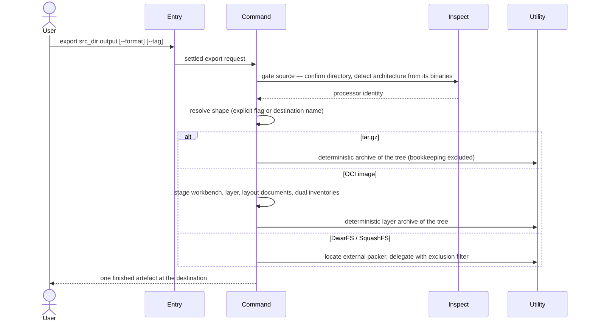

---
tags:
  - architecture
  - spec
  - export
---

# Exporting a Rootfs

| | |
|---|---|
| **Status** | As-built |
| **Trigger** | `flatroot export ./rootfs app.tar.gz` |
| **Actor** | A CLI user shipping a finished rootfs to a registry, a colleague, or a runtime |

## User Scenarios & Testing

### User Story 1 — Ship the tree as a portable archive

A user names a finished rootfs and a destination and receives one compressed archive any ordinary tool can unpack — reproducible, faithful to symlinks, and free of the builder's private bookkeeping.

**Independent test**: Export the same tree twice to `.tar.gz` and verify the two archives are byte-identical and contain no `.flatroot/` entry.

**Acceptance scenarios**:

1. **Given** a finished rootfs, **When** the user exports to `name.tar.gz`, **Then** the shape is inferred from the destination's name and one gzip-compressed archive appears with entries in deterministic name-sorted order.
2. **Given** a tree containing symlinks, **When** it is exported, **Then** the links are preserved as links rather than followed and duplicated.
3. **Given** the same tree exported twice, **When** the archives are compared, **Then** they are byte-identical.

### User Story 2 — Ship a container image both engines load

A user exports the tree as a single-layer container image and loads it under either major engine without a registry, tagged identically in both.

**Independent test**: Export with `--format oci --tag app:v1`, then `docker load` and `podman load` the same archive; both must import the image under `app:v1`.

**Acceptance scenarios**:

1. **Given** a tagged OCI export, **When** either engine loads the archive, **Then** the image imports under the given tag — carried in two standard index annotations (`org.opencontainers.image.ref.name` and `io.containerd.image.name`) and the engine-specific `RepoTags` inventory.
2. **Given** the export runs, **When** the image's platform is stamped, **Then** it is the architecture read from the tree's own binaries, never the build host's.
3. **Given** an OCI export requested without `--tag`, **When** the plan is settled, **Then** the run is refused up front with an example tag.

### User Story 3 — Ship a mountable filesystem image

A user exports the tree as a compressed read-only image (DwarFS or SquashFS) that mounts without unpacking, delegating the format to the host's own packer.

**Independent test**: Export to `.sqfs` on a host with the packer installed; verify the image mounts and contains no `.flatroot/` entry.

**Acceptance scenarios**:

1. **Given** the packer is absent from `PATH`, **When** the export runs, **Then** it is refused naming the tool and advising installation.
2. **Given** the packer exits non-zero, **When** the export runs, **Then** the export fails attributed to the tool by name — never mistaken for success.

## Requirements

### Functional requirements

**Source gate**

**FR-SOURCE-001**: The system MUST refuse a source that is missing or not a directory before the output shape is even chosen.

```console
$ flatroot export ./missing app.tar.gz     # ✗ refused: ./missing is not a directory
```

**FR-SOURCE-002**: The system MUST detect the tree's architecture from binaries the tree itself ships, and fail naming the candidates tried when none is readable.

```text
reads bin/sh, usr/bin/sh, usr/bin/env, usr/bin/coreutils, then bin/busybox / usr/bin/busybox from the tree → aarch64 — the host's own architecture is never consulted
```

**Shape selection**

**FR-SHAPE-001**: The system MUST honour an explicit `--format`, otherwise infer the shape from the destination's name (`.tar.gz`, `.sqfs`/`.squashfs`, `.dwarfs`), refuse the ambiguous bare `.tar`, and refuse a name that signals nothing.

```console
$ flatroot export ./root app.tar.gz                   # inferred: gzip archive
$ flatroot export ./root app.tar                      # ✗ ambiguous — two shapes claim .tar
$ flatroot export --format oci -t app:v1 ./root app.tar   # ✓ explicit flag settles it
```

**FR-SHAPE-002**: The system MUST require `--tag` for the OCI shape and ignore it for every other shape.

```console
$ flatroot export --format oci ./root app.tar              # ✗ OCI needs --tag (e.g. myapp:v1.0)
$ flatroot export -t ignored ./root app.tar.gz             # tag accepted and ignored
```

**Artefact fidelity**

**FR-ARTEFACT-001**: The system MUST exclude the builder's private bookkeeping (`.flatroot/`) from every artefact, whatever the shape.

```console
$ tar tzf app.tar.gz | grep '^\.flatroot'    # no output — across all four shapes
```

**FR-ARTEFACT-002**: The system MUST lay archive entries down in deterministic name-sorted order so identical trees yield identical bytes.

```console
$ flatroot export ./root a.tar.gz && flatroot export ./root b.tar.gz && cmp a.tar.gz b.tar.gz   # identical
```

**FR-ARTEFACT-003**: The system MUST preserve symlinks as links and write files in the plain, broadly accepted archive form (no sparse-entry encoding) so stricter container parsers accept the result.

```text
usr/bin/sh → dash stays a link; no GNU sparse entries that a strict OCI layer parser would reject
```

**Container image assembly**

**FR-OCI-001**: The system MUST assemble the container image in a throwaway staging area and seal it only at the end, so a failed export never leaves a half-formed image presented as finished.

```text
blobs, index, manifest, config staged in a workbench → sealed into app.tar as the last act
```

**FR-OCI-002**: The system MUST record the image's identity in three places so one archive loads tagged under either engine: two annotations on the standard index — `org.opencontainers.image.ref.name` (read by podman) and `io.containerd.image.name` (read by docker's containerd store) — plus the engine-specific `RepoTags` inventory (read by docker's classic store).

```console
$ docker load -i app.tar    # → app:v1
$ podman load -i app.tar    # → app:v1 — same archive, same tag, both engines
```

**External packers**

**FR-TOOL-001**: The system MUST locate an external packer before any work begins and treat its non-zero exit as the export's failure.

```console
$ flatroot export ./root app.dwarfs    # ✗ refused up front when mkdwarfs is not on PATH
# a packer that starts and then fails midway fails the export, attributed to the tool by name
```

**Independence**

**FR-LOCAL-001**: The system MUST require no source selector and no network — the export consumes only what is on disk.

```console
$ flatroot export ./root app.tar.gz    # no --from, works offline
```

### Key entities

- **Export plan** — the settled decision: output shape (explicit or inferred) and optional registry tag.
- **Rootfs source** — the gated description of the tree: validated location plus the architecture read from its own binaries.
- **Container image pieces** — the content-addressed blobs, layout marker, index, manifest, config, and the second engine's inventory, staged in the workbench and sealed into one archive.

## Success Criteria

### Measurable outcomes

- **SC-001**: Exporting the same tree twice yields byte-identical archives.
- **SC-002**: `.flatroot/` appears in zero exported artefacts across all four shapes.
- **SC-003**: One OCI archive imports successfully — and tagged identically — under both major engines.
- **SC-004**: A failed export leaves no artefact at the destination that could be mistaken for a finished one.

## Assumptions

- The source directory is a real rootfs whose architecture is detectable from its own conventional binaries.
- For filesystem-image shapes, the external packer (`mkdwarfs` or `mksquashfs`) is on the host's `PATH`.
- No network and no source selector are needed.

## Edge Cases

- What happens with a destination named `name.tar`? Refused as ambiguous — two shapes claim that extension (FR-SHAPE-001).
- What happens when the tree ships no readable binary among its conventional shells and tools? Hard error naming the candidates tried (FR-SOURCE-002).
- What happens with `--tag` on a non-OCI shape? Accepted and ignored (FR-SHAPE-002).
- What happens when the packaging tool is present but fails midway? The export fails attributed to the tool (FR-TOOL-001).

## Execution flow *(as-built)*

| # | Operation | Performed by | Source |
|---|---|---|---|
| 1 | Gate the source first — before the output shape is chosen: confirm the directory is really there, and detect the hardware it targets by reading the processor stamp from its own binaries | [Subcommand Orchestration](../packages.md#subcommand-orchestration), [Binary and System Inspection](../packages.md#binary-and-system-inspection) | `src/commands/export/source.rs`, `src/arch.rs` |
| 2 | Settle the invocation into an export plan — honour an explicit `--format`, otherwise read the intent from the destination's name, refusing the ambiguous and the unguessable | [Subcommand Orchestration](../packages.md#subcommand-orchestration) | `src/commands/export/plan.rs` |
| 3 | Enforce the chosen shape's requirements before any packaging — the OCI shape cannot be named without its tag | [Subcommand Orchestration](../packages.md#subcommand-orchestration) | `src/commands/export/plan.rs` |
| 4 | Archive shape: pack the tree into one gzip-compressed archive in deterministic name-sorted order, links preserved, bookkeeping excluded | [Subcommand Orchestration](../packages.md#subcommand-orchestration), [Generic Utility Tier](../packages.md#generic-utility-tier) | `src/commands/export/tar.rs`, `src/internal/tar.rs` |
| 5 | Container-image shape: stage a content-addressed workbench, turn the tree into the image's single layer, write the standard layout documents and the second engine's own inventory beside them, and seal everything into one archive both engines load | [Subcommand Orchestration](../packages.md#subcommand-orchestration) | `src/commands/export/oci/` |
| 6 | Filesystem-image shapes: locate the external packer up front and delegate, treating its refusal as the export's failure and excluding the bookkeeping through the packer's own filter | [Subcommand Orchestration](../packages.md#subcommand-orchestration), [Generic Utility Tier](../packages.md#generic-utility-tier) | `src/commands/export/dwarfs.rs`, `src/commands/export/sqfs.rs`, `src/internal/tool.rs` |



--8<-- "_glossary.md"
