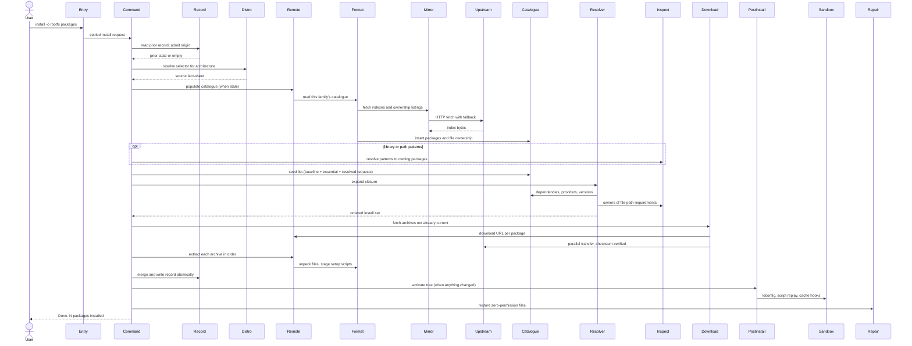

---
tags:
  - architecture
  - spec
  - install
---

# Installing Packages

| | |
|---|---|
| **Status** | As-built |
| **Trigger** | `flatroot --from debian:bookworm install -o ./rootfs bash` |
| **Actor** | A CLI user — a person at a terminal or a driving program such as a build pipeline |

## User Scenarios & Testing

### User Story 1 — Build a fresh rootfs

A user names a distribution, a release, a destination directory, and the packages they care about, and receives a complete root filesystem: the requested packages, everything they silently require, and the distribution's own baseline, laid down in a working order, configured as a real install would have configured it, and described by a truthful on-disk record.

**Independent test**: Run a single install of one package into an empty directory against a live mirror; verify the tree boots a shell, the record exists, and the exit code is `0`.

**Acceptance scenarios**:

1. **Given** an empty destination and a reachable mirror, **When** the user installs `bash` from `debian:bookworm`, **Then** the destination contains `bash`, its transitive closure, and the essential baseline, extracted in the resolver's settled order (baseline and essential packages first), and `.flatroot/` records every package with provenance and integrity.
2. **Given** a package name absent from the release's catalogue, **When** the user installs it, **Then** the run fails naming the package and the destination's prior state is untouched.
3. **Given** unprivileged user namespaces are available, **When** the install completes extraction, **Then** the loader cache is rebuilt, each package's staged setup script is replayed inside the sandbox, content-derived caches are regenerated, and no file is left with zero permissions.

### User Story 2 — Extend or repeat an install

A user re-runs an install over an existing tree — the same request, or a widened one — and pays only for what genuinely changed: packages already present at the same version and content are recognised and skipped, and the finishing work is skipped entirely when nothing was re-extracted.

**Independent test**: Run the identical install twice; the second run must download nothing, extract nothing, and report `Nothing to do.`

**Acceptance scenarios**:

1. **Given** a tree recorded from `debian:bookworm`, **When** the same install runs again, **Then** every resolved package is recognised as current, no archive is downloaded or extracted, activation is skipped, and the record is unchanged.
2. **Given** a tree recorded from `debian:bookworm`, **When** the user installs one additional package, **Then** only the genuinely new packages are fetched and extracted, prior records are carried forward verbatim, and the merged record reflects the union.
3. **Given** a tree recorded from a different origin (other distro, release, snapshot date, or pinned-vs-unpinned), **When** any install targets it, **Then** the run is refused before any network or disk work, naming both origins and the way out.

### User Story 3 — Reproduce a build from a pinned date

A user pins the source to a calendar date (`debian:bookworm@2026-04-21`) so the same invocation reproduces the same tree later, drawing every index and archive from the distribution's frozen snapshot archive.

**Independent test**: Install with an `@date` pin, record the manifest; re-run after the live archive has moved on and verify the recorded versions are identical.

**Acceptance scenarios**:

1. **Given** a dated selector, **When** the install runs, **Then** every repository in the source fact-sheet points at the snapshot service for that date and the record stores the dated selector as the origin.

### User Story 4 — Build a multiarch tree

A user names several architectures (`--arch x86_64,i686`) and receives one tree holding each architecture's packages side by side, with the record keyed by `(name, architecture)` so the same package may appear once per width.

**Independent test**: Install the same package for two architectures into one destination; verify per-arch library directories coexist and the record carries one entry per `(name, arch)` pair.

**Acceptance scenarios**:

1. **Given** two architectures, **When** the install runs, **Then** the full pipeline runs once per architecture into the same destination, the record is written once after both succeed, and activation runs once against the combined tree.

### User Story 5 — Install by library or installed path

A user does not know the distro's package name — only the library a program failed to load, or the concrete file they need on the rootfs (a font file, a command, a data file) — and installs by naming that instead: the matching packages are resolved through the same match spaces `search` and `analyze trace` already offer, and installed with their full closure; when one file is shipped by several packages, naming a second file with `--match all` narrows the owners to the package that ships both.

**Independent test**: Run `install --type path -o ./root 'usr/bin/gimp'` against a live Debian release; verify `gimp` and its closure land in the tree and the record names the resolved package, not the pattern.

**Acceptance scenarios**:

1. **Given** `--type library` and a soname pattern, **When** the install runs, **Then** the owning packages are resolved exactly as `search --type library` resolves them, deduplicated, and installed with their closure as if the user had named them.
2. **Given** `--type path` and a path pattern, **When** the install runs, **Then** the packages shipping matching paths are resolved through the file-ownership record and installed with their closure.
3. **Given** `--type path` against an apk source, **When** the install is requested, **Then** it is refused with the reason — Alpine publishes no file lists — before any package is downloaded or extracted (the catalogue index is fetched first, then the pattern resolution refuses).
4. **Given** a pattern that matches no package, **When** the install runs, **Then** the run fails naming the pattern, exactly as an unknown package name fails today.
5. **Given** `--type path --match all` with one or more path patterns, **When** the install runs, **Then** only a package owning a match for every listed pattern is seeded — one pattern keeps its own owners, a second (or more) narrows to what they all share; under the default `--match any` the owners of any matched path are all seeded, and `--match all` with `--type package` is refused.

## Requirements

### Functional requirements

**Origin guard**

**FR-ORIGIN-001**: The system MUST refuse to install into a destination whose record names a different source than the request — different distribution, release, snapshot date, or pinned-vs-unpinned — before any network or disk work is spent.

```console
$ flatroot --from debian:bookworm install -o ./root bash    # records origin debian:bookworm
$ flatroot --from ubuntu:noble install -o ./root vlc        # ✗ refused: ./root belongs to debian:bookworm
$ flatroot --from debian:bookworm@2026-04-21 install -o ./root vlc   # ✗ refused: pinned vs unpinned differ
```

**Seeding**

**FR-SEED-001**: The system MUST seed resolution with the distribution's baseline packages, the packages the catalogue marks essential, and the user's requested packages, deduplicated.

```console
$ flatroot --from debian:bookworm install -o ./root htop
# seeds: htop + debian's baseline (empty for Debian) + every package marked Essential: yes (base-files, …)
```

**FR-SEED-002**: The system MUST support `--no-deps` as an existence-checked install of exactly the named packages — no baseline, no essential set, no closure.

```console
$ flatroot --from debian:bookworm install -o ./root --no-deps htop   # extracts htop alone
$ flatroot --from debian:bookworm install -o ./root --no-deps ghost  # ✗ unknown name still fails
```

**Seed match spaces**

**FR-TYPE-001**: The system MUST accept `--type <package|library|path>` on `install` (default `package`), selecting the match space the positional arguments are resolved through before seeding.

```console
$ flatroot --from debian:bookworm install -o ./root bash                          # package names (default)
$ flatroot --from debian:bookworm install -o ./root --type library 'libssl.so.3'  # by soname
$ flatroot --from debian:bookworm install -o ./root --type path 'usr/bin/gimp'    # by installed path
```

**FR-TYPE-002**: The system MUST treat every positional argument, under every match space, as a shell-style pattern in the same dialect `search` uses — matching exactly when it carries no wildcard, and expanding to every match when one is given.

```console
$ flatroot --from debian:bookworm install -o ./root bash         # exact: never matches bash-doc
$ flatroot --from debian:bookworm install -o ./root 'php8.2-*'   # explicit wildcard: every match installs
```

**FR-TYPE-003**: The system MUST resolve `library` and `path` patterns to their owning packages through the same match spaces `search` uses — both sources of truth for libraries, the file-ownership record for paths — deduplicate the owners, echo each non-identity resolution on stderr, and seed the install with the owners as if the user had named them.

```console
$ flatroot --from debian:bookworm install -o ./root --type path 'bin/bash'
Resolved 'bin/bash' -> bash
# installs bash + closure; the record names bash, never the pattern
```

**FR-TYPE-004**: The system MUST refuse `--type path` against an apk source with the reason — Alpine publishes no file lists — and MUST fail a pattern that resolves to no package, naming the pattern.

```console
$ flatroot --from alpine:v3.21 install -o ./root --type path 'usr/bin/bash'   # ✗ apk publishes no file lists
$ flatroot --from debian:bookworm install -o ./root --type path 'zzz/none'    # ✗ pattern matched no package
```

**FR-TYPE-005**: Under several `--arch` values, the system MUST resolve the patterns per architecture against that architecture's catalogue, so each width seeds with its own owners.

```console
$ flatroot --from debian:bookworm --arch x86_64,i686 install -o ./root --type library 'libssl.so.3'
# each architecture's pass resolves the soname against its own index
```

**Pattern combination**

**FR-COMBINE-001**: The system MUST accept `--match <any|all>` (default `any`), choosing how the per-pattern owning-package sets combine when a pattern resolves to a *set* of owners (`--type library`, `--type path`). `any` unions the sets — every pattern's owners are seeded. `all` intersects them — only a package that owns a match for *every* pattern is seeded, so a second file disambiguates a path several packages share.

```console
$ flatroot --from debian:bookworm install -o ./root --type path usr/sbin/sendmail usr/sbin/postfix
# any (default): every owner of either path — courier-mta, exim4-daemon-light, postfix, …

$ flatroot --from debian:bookworm install -o ./root --type path --match all usr/sbin/sendmail usr/sbin/postfix
Resolved 'usr/sbin/sendmail' -> courier-mta dma exim4-daemon-heavy exim4-daemon-light msmtp-mta nullmailer opensmtpd postfix ssmtp
# all: only the package owning both — postfix
```

**FR-COMBINE-002**: The system MUST refuse `--match all` with `--type package` — a package pattern already names its package, so there is no owner set to intersect — before any catalogue is fetched, never silently downgrading it to a union.

```console
$ flatroot --from debian:bookworm install -o ./root --type package --match all bash zsh
# ✗ --match all is meaningful only with --type path or --type library
```

**FR-COMBINE-003**: Under `--match all`, the system MUST fail the install when the patterns' owner sets share no common package — naming the patterns — after each pattern individually matched at least one package.

```console
$ flatroot --from debian:bookworm install -o ./root --type path --match all usr/sbin/sendmail bin/bash
# ✗ No package owns a match for every pattern under --match all: usr/sbin/sendmail bin/bash
```

**Closure resolution**

**FR-RESOLVE-001**: The system MUST expand the seeds into the complete transitive dependency closure before anything is fetched.

```console
$ flatroot --from alpine:v3.21 install -o ./root bash
Resolved 9 packages        # bash + musl, ncurses-libs, … — the closure, never bash alone
```

**FR-RESOLVE-002**: The system MUST honour dependency alternatives in author-preference order — the first satisfiable alternative wins.

```text
Depends: awk | gawk | mawk      # the packager's preference order is the tie-break, not alphabet
```

**FR-RESOLVE-003**: The system MUST resolve virtual capabilities to a concrete provider with deterministic choice — the same catalogue always yields the same provider.

```text
Depends: mail-transport-agent   # a virtual name: some real package provides it, chosen deterministically
```

**FR-RESOLVE-004**: The system MUST judge every version constraint under the distribution family's own ordering rules (dpkg ordering for deb, rpm ordering for the RPM family).

```text
Depends: libc6 (>= 2.36)        # 2.36-9+deb12u4 satisfies under dpkg rules, not string comparison
```

**FR-RESOLVE-005**: The system MUST re-evaluate conditional (rich) dependencies against the growing install set to a fixpoint, folding each satisfied payload in atomically.

```text
Requires: (gcc if gcc-devel)    # RPM rich dep: evaluated, re-evaluated as the set grows, all-or-nothing
```

**FR-RESOLVE-006**: The system MUST admit trigger-based courtesy installs (Alpine `install_if`) with all-or-nothing admission — an unresolvable trigger drops with a warning, never half-applies.

```text
install_if: docs wget-doc       # pulled in only when every trigger member is present
```

**FR-RESOLVE-007**: The system MUST honour `--exclude` by dropping the named packages and anything reachable only through them.

```console
$ flatroot --from debian:bookworm install -o ./root firefox-esr --exclude libavcodec59
# libavcodec59 and packages only it pulled in are pruned from the closure
```

**FR-RESOLVE-008**: The system MUST honour `--with recommends,suggests` by widening the closure along the distribution's soft edges.

```console
$ flatroot --from debian:bookworm install -o ./root vlc --with recommends
# follows Recommends: edges in addition to Depends:
```

**Download and integrity**

**FR-FETCH-001**: The system MUST reuse the local archive cache and skip downloading any package whose cached archive still proves against its checksum.

```console
$ flatroot --from debian:bookworm install -o ./root2 bash   # second tree, same source
Downloaded 142 packages (0 already current)                 # every archive served from the cache — no bytes over the network
```

**FR-FETCH-002**: The system MUST verify every archive against the catalogue's checksum, re-fetch once on mismatch, and fail hard rather than extract bytes that still disagree.

```text
checksum mismatch for bash_5.2.15-2+b10_amd64.deb → one re-fetch → still wrong → ✗ hard failure
```

**Incremental installs**

**FR-INCR-001**: The system MUST recognise packages already recorded at the same version and checksum and carry their prior records forward without downloading or extracting them.

```console
$ flatroot --from debian:bookworm install -o ./root bash    # again, unchanged index
Nothing to do. All 142 packages already current in ./root
```

**Extraction**

**FR-EXTRACT-001**: The system MUST extract the closure in the resolver's settled order, and MUST seed resolution with the distribution's baseline and essential packages ahead of the user's requests, so the layout-creating packages (`usrmerge`, `filesystem`) are laid down before the packages that drop files into the directories and symlinks they establish.

```text
essential/baseline seeds (usrmerge, filesystem, …) are queued first → user packages and their closure follow
# the merged-usr symlinks exist before any later package drops files into them
```

**Record**

**FR-RECORD-001**: The system MUST write the install record only after every requested architecture has succeeded, using atomic file replacement ordered so a crash can never strand a summary that disagrees with its detail.

```text
.flatroot/files/<pkg>:<arch> first, then packages, then manifest — each swapped in atomically
```

**Activation**

**FR-ACTIVATE-001**: The system MUST stage each package's maintainer scripts aside during extraction and replay them only after the whole closure is on disk, inside an unprivileged user+mount namespace sandbox, behind harmless stand-ins for privileged commands.

```text
postinst staged at extract time → replayed after the full tree exists, inside the sandbox, mount/umount stubbed
```

**FR-ACTIVATE-002**: The system MUST run the requested activation phases (`ldconfig`, `scripts`, `hooks`) in that fixed order, and skip them all when nothing was re-extracted.

```console
$ flatroot --from debian:bookworm install -o ./root bash --postinstall ldconfig,scripts
# ldconfig first, then script replay; hooks not requested; a no-op install skips all three
```

**FR-ACTIVATE-003**: The system MUST refuse the contradictory `--postinstall=none` combined with named phases.

```console
$ flatroot --from debian:bookworm install -o ./root bash --postinstall none,ldconfig   # ✗ self-contradictory
```

**FR-ACTIVATE-004**: The system MUST treat a single misbehaving setup script or cache hook as a reported, non-fatal event that never abandons the rest of activation.

```text
postinst of pkg X exits 1 → reported tersely on stderr → activation continues with the next package
```

**FR-ACTIVATE-005**: The system MUST repair files left with zero permissions so the tree's owner can read everything the build produced.

```text
a 0000-mode file an unprivileged extraction produced → repaired before the run reports success
```

**CLI conventions**

**FR-CLI-001**: The system MUST accept every flag through its `FLATROOT_ARG_*` environment equivalent.

```console
$ FLATROOT_ARG_FROM=debian:bookworm FLATROOT_ARG_INSTALL_OUTPUT=./root flatroot install bash
```

**FR-CLI-002**: The system MUST keep stdout free of progress and notices; all human-facing output goes to stderr.

```console
$ flatroot --from debian:bookworm install -o ./root bash 2>/dev/null   # stdout: nothing — progress is stderr
```

### Key entities

- **Install record** — the durable account under `.flatroot/`: a summary header, one stanza per installed package (identity pinned to architecture, provenance, integrity, requirements), and one file ledger per package.
- **Package catalogue** — the local, queryable picture of everything the release offers, populated from the published indexes and reused within its freshness window.
- **File-ownership index** — the compact companion mapping a file path to its owning package, consulted for path-shaped requirements.
- **Dependency closure** — the ordered install set plus the provenance of every inclusion.
- **Archive cache** — the per-source store of verified downloads reused across runs.

## Success Criteria

### Measurable outcomes

- **SC-001**: Re-running an identical install performs zero downloads and zero extractions and exits `0` reporting nothing to do.
- **SC-002**: A run that fails at any point before the record is written leaves the destination's previous record byte-for-byte intact.
- **SC-003**: No archive whose content disagrees with its recorded checksum is ever extracted into the tree.
- **SC-004**: After a successful install, zero files in the tree carry empty (0000) permissions.
- **SC-005**: An install interrupted and re-run converges to the same recorded state as an uninterrupted one.

## Assumptions

- The network is reachable, or the index and archive caches are warm enough to serve the request.
- Unprivileged user namespaces are available whenever any post-install phase is requested.
- The destination is empty, absent, or recorded with the same source selector.
- The requested package names exist in the chosen release's catalogue.

## Edge Cases

- What happens when the destination holds a foreign origin's record? Refused up front, naming both origins (FR-ORIGIN-001).
- What happens when user namespaces are unavailable but phases were requested? Refused with the kernel knob to enable and the `--postinstall=none` escape.
- What happens when a mirror serves a stale archive? One re-fetch, then hard failure (FR-FETCH-002).
- What happens when a published catalogue entry carries a malformed size field? Catalogue population fails naming the field and its value — corruption is refused, never recorded as a zero-size fact.
- What happens when the process crashes mid-extraction? The prior record stands; the next run re-converges (SC-002, SC-005).
- What happens when one package's setup script fails? Reported tersely, stepped over, activation continues (FR-ACTIVATE-004).
- What happens when `--postinstall=none` is combined with named phases? Refused as self-contradictory (FR-ACTIVATE-003).
- What happens with an explicit `install '*'`? Every package in the release installs — a typed wildcard is user intent, not an error, and the closure follows (FR-TYPE-002).
- What happens with `--type path` on an apk source, or a pattern matching nothing? Refused with the reason / failed naming the pattern (FR-TYPE-004).
- What happens with `--match all --type package`? Refused — a package pattern already names its package, so there is no owner set to intersect (FR-COMBINE-002).
- What happens when `--match all` patterns share no common owner? Failed naming the patterns — a request for a package that does not exist, distinct from a pattern that itself matched nothing (FR-COMBINE-003).

## Execution flow *(as-built)*

| # | Operation | Performed by | Source |
|---|---|---|---|
| 1 | Settle the invocation into a typed request — source required, output required, architectures parsed, post-install phases reconciled (refusing `none` mixed with named phases) | [Command-Line Entry and Dispatch](../packages.md#command-line-entry-and-dispatch) | `src/parser.rs`, `src/executor.rs` |
| 2 | Read the destination's existing record and admit or refuse the source, before any network or disk work is spent | [Rootfs Build Record](../packages.md#rootfs-build-record) | `src/manifest/state.rs` |
| 3 | Resolve the selector into a concrete source fact-sheet — mirrors, repository layout, native architecture name, baseline packages (the RHEL and pacman families draw theirs from one shared owner) — vetting distribution and architecture support | [Distribution Catalog](../packages.md#distribution-catalog) | `src/distro/registry.rs`, `src/distro/base_packages.rs` |
| 4 | Populate the local catalogue and file-ownership index from the published repository metadata, or reuse a fresh cached copy — once per requested architecture, drawing on the run's settled fetch session | [Subcommand Orchestration](../packages.md#subcommand-orchestration), [Format-Neutral Repository Access](../packages.md#format-neutral-repository-access), [Package-Format Parsing and Extraction](../packages.md#package-format-parsing-and-extraction), [Persistent Package Catalogue](../packages.md#persistent-package-catalogue) | `src/commands/session.rs`, `src/commands/arch_context.rs`, `src/remote/source.rs`, `src/pkg/`, `src/db.rs` |
| 5 | Resolve the user's patterns through the requested match space — package names directly, library or path patterns to their owning packages (apk refused for paths), combined by union or, under `--match all`, by intersection — then assemble the seed list: the distribution's baseline packages, the packages the catalogue marks essential, and the resolved requests | [Subcommand Orchestration](../packages.md#subcommand-orchestration), [Binary and System Inspection](../packages.md#binary-and-system-inspection) | `src/commands/install.rs`, `src/library.rs`, `src/path.rs` |
| 6 | Expand the seeds into the complete, ordered dependency closure — alternatives, virtual capabilities, version constraints, conditional and trigger-based pulls all honoured | [Dependency Closure Resolution](../packages.md#dependency-closure-resolution) | `src/resolver/` |
| 7 | Partition the closure against the prior record: packages already present at the same version and checksum are carried forward untouched; only the rest is fetched | [Subcommand Orchestration](../packages.md#subcommand-orchestration), [Rootfs Build Record](../packages.md#rootfs-build-record) | `src/commands/install.rs` |
| 8 | Download the missing archives in parallel, reusing the local archive cache and proving every file against the catalogue's checksum — using the integrity claim owned by the record package | [Verified Parallel Download](../packages.md#verified-parallel-download) | `src/downloader.rs`, `src/manifest/checksum.rs` |
| 9 | Extract each archive into the shared tree in the resolver's settled order — files laid down, per-package setup scripts staged aside for later replay | [Format-Neutral Repository Access](../packages.md#format-neutral-repository-access), [Package-Format Parsing and Extraction](../packages.md#package-format-parsing-and-extraction) | `src/remote/source.rs`, `src/pkg/` |
| 10 | Merge the fresh work into the prior record and write it durably — per-package file ledgers first, then the inventory, then the summary, each swapped into place atomically | [Rootfs Build Record](../packages.md#rootfs-build-record) | `src/manifest/` |
| 11 | Activate the tree: rebuild the loader cache, replay each package's staged setup script inside the sandbox behind harmless stand-ins, and regenerate content-derived caches — skipped entirely when nothing was re-extracted | [Post-Install Finishing](../packages.md#post-install-finishing), [Unprivileged Execution Sandbox](../packages.md#unprivileged-execution-sandbox) | `src/postinstall/`, `src/sandbox.rs` |
| 12 | Repair the files an unprivileged extraction left without permissions, so the tree's owner can actually read what they built | [Final Permission Repair](../packages.md#final-permission-repair) | `src/postfixes/` |

The resolver consults the file-ownership index ([Binary and System Inspection](../packages.md#binary-and-system-inspection), `src/path_index.rs`) for requirements phrased as file paths, and judges every version constraint through the distribution family's ordering rules ([Version Ordering and Constraints](../packages.md#version-ordering-and-constraints), `src/version/`).



--8<-- "_glossary.md"
