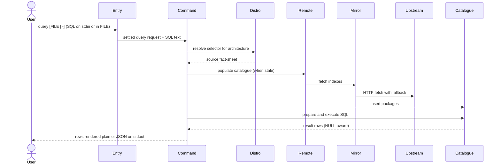

---
tags:
  - architecture
  - spec
  - query
---

# Querying the Catalogue

| | |
|---|---|
| **Status** | As-built |
| **Trigger** | `echo 'SELECT name, version FROM packages LIMIT 5' \| flatroot --from arch:rolling query` |
| **Actor** | A CLI user auditing a distribution's catalogue, debugging a resolution puzzle, or asking a question no built-in command exposes |

## User Scenarios & Testing

### User Story 1 — Ask the catalogue a free-form question

A user poses raw SQL against the same local catalogue every other command reads, and gets the result rows back in a shape that is easy to inspect or feed onward — the escape hatch for questions the built-in lookups never anticipated.

**Independent test**: Pipe a `SELECT` over a populated catalogue and verify the rows match what the built-in search reports for the same names.

**Acceptance scenarios**:

1. **Given** a populated catalogue, **When** the user runs a valid `SELECT`, **Then** stdout carries one record per result row in the requested encoding.
2. **Given** SQL that fails to prepare (syntax error, unknown table), **When** the query runs, **Then** the run fails carrying the store's own diagnostic and the offending SQL.
3. **Given** a query yielding zero rows, **When** it runs, **Then** stdout carries zero bytes in plain mode and the exit code is `0`.

### User Story 2 — Reuse a question from a file or a pipe

A user keeps a query in a `.sql` file they edit and reuse, or types one on the spot via stdin; both routes collapse into the same text before anything acts on it.

**Independent test**: Run the same SQL once from a file and once piped with `-`; outputs must be identical.

**Acceptance scenarios**:

1. **Given** a named `.sql` file, **When** the query runs, **Then** the file's text is executed; **Given** `-` or no file argument, **Then** stdin is read instead.
2. **Given** an unreadable file path, **When** the query runs, **Then** the run fails naming the file.

## Requirements

### Functional requirements

**Request**

**FR-SOURCE-001**: The system MUST require a source selector and refuse its absence with example selectors.

```console
$ echo 'SELECT 1' | flatroot query    # ✗ --from is required. Example: --from debian:bookworm, …
```

**Question intake**

**FR-INPUT-001**: The system MUST accept the question from a named file, from `-`, or from stdin when the file argument is omitted, collapsing all routes into one piece of text.

```console
$ flatroot --from debian:bookworm query analysis.sql            # from a file
$ echo 'SELECT count(*) FROM packages' | flatroot --from debian:bookworm query     # from stdin
$ flatroot --from debian:bookworm query - <<< 'SELECT count(*) FROM packages'      # explicit -
```

**Execution**

**FR-EXECUTE-001**: The system MUST execute the question against the local catalogue store through the one deliberate escape hatch past the curated query views.

```console
$ echo 'SELECT name FROM packages WHERE essential = 1' | flatroot --from debian:bookworm query
# the same SQLite store search/install/trace read — packages, dependencies, provides, install_if, rich_deps
```

**FR-EXECUTE-002**: The query path opens the local catalogue store read-write and runs the actor's SQL verbatim with no statement-kind guard, so query is read-only only by convention. A mutating statement (`DELETE`, `UPDATE`) really does change the cached store, and the change persists until the catalogue's freshness window lapses and it is rebuilt; nothing upstream is touched beyond the usual index fetch.

```console
$ echo 'SELECT 1' | flatroot --from debian:bookworm query        # a SELECT warms the cache and mutates nothing
$ echo 'DELETE FROM packages' | flatroot --from debian:bookworm query   # but this DOES mutate the cached index, for up to its TTL
```

**Rendering**

**FR-RENDER-001**: The system MUST preserve the distinction between a NULL cell and an empty value all the way to presentation: plain mode omits the line entirely, JSON mode records an explicit `null`.

```console
$ echo "SELECT p.name AS provider, prov.version FROM provides prov JOIN packages p ON p.id = prov.package_id WHERE prov.name = 'awk'" | flatroot --from debian:bookworm query
query.0.cells.0.column=provider
query.0.cells.0.value=gawk
query.0.cells.1.column=version        # gawk provides 'awk' unversioned → no value line for version
query.1.cells.0.column=provider
query.1.cells.0.value=mawk
query.1.cells.1.column=version
query.2.cells.0.column=provider
query.2.cells.0.value=original-awk
query.2.cells.1.column=version
$ … --format json                     # each version cell instead carries "value": null
```

**FR-RENDER-002**: The system MUST render results in the two encodings selected by `--format`. A result row is an ordered list of cells, and every cell carries its column name as a *value* — never as a key — alongside the cell value, so a column name may contain any character (a dot, an `=`, a duplicate of another column) without colliding with the encoding's structure. The two encodings are not bijective for query: as FR-RENDER-001 requires, plain mode omits a NULL cell's value line that JSON records as explicit `null`, so a row carrying NULLs does not round-trip plain→JSON.

```console
$ echo 'SELECT name, version FROM packages LIMIT 2' | flatroot --from debian:bookworm query
query.0.cells.0.column=name
query.0.cells.0.value=…
query.0.cells.1.column=version
query.0.cells.1.value=…           # cells follow SELECT order; plain and JSON carry the same facts
```

### Key entities

- **Query row** — one result row as an ordered list of cells, each pairing a column name with an optional value; the order preserves the SELECT and the optionality carries the NULL-versus-empty truth. A column name is data, carried as a cell value and never as an output key, so it may contain any character (dots, `=`, duplicates) without colliding with the encoding.
- **Catalogue store** — the populated SQLite picture of the release (`packages`, `dependencies`, `provides`, `install_if`, `rich_deps`), documented in the [Database reference](../../reference/database.md).

## Success Criteria

### Measurable outcomes

- **SC-001**: A NULL cell never produces an output line in plain mode and always appears as explicit `null` in JSON mode.
- **SC-002**: The same SQL delivered by file and by stdin produces byte-identical output.
- **SC-003**: A zero-row result exits `0` with zero stdout bytes in plain mode.

## Assumptions

- A source selector is given; the question runs against that source's catalogue for the chosen architecture.
- The network is reachable, or a fresh cached catalogue exists.
- The caller knows the store's schema (documented in the database reference).

## Edge Cases

- What happens when every mirror fails and no fresh cache exists? Hard error after the retry budget.
- What happens with non-text cells? Blob values render as a placeholder marker rather than raw bytes.
- What happens with a statement that is valid SQL but not a query? It executes through the same prepare/execute path; whatever rows it yields are rendered.

## Execution flow *(as-built)*

| # | Operation | Performed by | Source |
|---|---|---|---|
| 1 | Settle the invocation and gather the question — from the named file or from stdin, collapsed into one piece of text before anything acts on it | [Command-Line Entry and Dispatch](../packages.md#command-line-entry-and-dispatch), [Subcommand Orchestration](../packages.md#subcommand-orchestration) | `src/executor.rs`, `src/commands/query.rs` |
| 2 | Resolve the selector to a source fact-sheet and populate or reuse the local catalogue, drawing on the run's settled fetch session | [Subcommand Orchestration](../packages.md#subcommand-orchestration), [Distribution Catalog](../packages.md#distribution-catalog), [Format-Neutral Repository Access](../packages.md#format-neutral-repository-access), [Persistent Package Catalogue](../packages.md#persistent-package-catalogue) | `src/commands/session.rs`, `src/commands/arch_context.rs`, `src/distro/`, `src/remote/`, `src/db.rs` |
| 3 | Prepare and execute the question against the catalogue store, through the one deliberate escape hatch past the curated query views | [Subcommand Orchestration](../packages.md#subcommand-orchestration), [Persistent Package Catalogue](../packages.md#persistent-package-catalogue) | `src/commands/query.rs`, `src/db.rs` |
| 4 | Gather every result row, preserving the distinction between a NULL cell and an empty value | [Subcommand Orchestration](../packages.md#subcommand-orchestration) | `src/commands/query.rs` |
| 5 | Render the rows — plain mode omits NULL cells entirely so every emitted line is a fact, JSON mode records the absence explicitly | [Subcommand Orchestration](../packages.md#subcommand-orchestration) | `src/commands/report.rs`, `src/internal/printer_plain.rs` |



--8<-- "_glossary.md"
