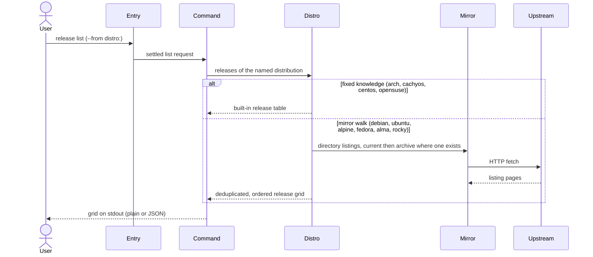

---
tags:
  - architecture
  - spec
  - release
---

# Listing Releases

| | |
|---|---|
| **Status** | As-built |
| **Trigger** | `flatroot --from debian: release list` |
| **Actor** | A CLI user choosing which release of a distribution to pin a build to |

## User Scenarios & Testing

### User Story 1 — See the menu of releases

A user names a distribution and receives the honest catalogue of its releases right now — including, where the distribution publishes a long-term archive, old releases that have aged out of the main archive but remain installable, and rolling streams no version number describes — with lookalike noise filtered out.

**Independent test**: List releases for a mirror-walked distribution and verify a retired release appears, attributed to the long-term archive that actually serves it.

**Acceptance scenarios**:

1. **Given** a mirror-walked distribution (Debian-family, Alpine, Fedora-style), **When** the listing runs, **Then** the releases are read from the distribution's own mirrors — and, where the distribution publishes a long-term archive, from that archive behind the current one — deduplicated across mirrors and ordered as a person expects: numerically where the release names are numbers (Fedora, the RHEL majors), and by codename string where they are codenames (the Debian-family walk).
2. **Given** a distribution that publishes nothing walkable (rolling-only or fixed-history), **When** the listing runs, **Then** the fixed built-in table is presented in the same uniform grid, indistinguishable in shape from a discovered one.
3. **Given** a selector with a release part (`debian:bookworm`), **When** the listing runs, **Then** the release part is ignored — the question is about the distribution as a whole.

## Requirements

### Functional requirements

**Request**

**FR-SOURCE-001**: The system MUST require a selector naming the distribution and refuse an unknown prefix with the full set of supported prefixes.

```console
$ flatroot --from debian release list      # ✓ release part not needed
$ flatroot --from ghost release list       # ✗ unknown distribution — supported set spelled out
```

**Discovery**

**FR-DISCOVER-001**: The system MUST discover releases the way each distribution publishes them: a mirror walk under family-specific naming rules where a browsable layout exists, a fixed built-in table where none does.

```console
$ flatroot --from debian release list      # walks deb.debian.org + archive.debian.org listings
$ flatroot --from arch release list        # fixed knowledge: rolling — nothing walkable upstream
```

**FR-DISCOVER-002**: Where a distribution publishes a long-term archive (Debian, Ubuntu, Fedora), the system MUST consult that archive behind the current mirror, so retired-but-installable releases never silently drop out, each attributed to the mirror that vouches for it. Distributions that publish no archive (Alpine, AlmaLinux, Rocky) are listed from their single live mirror.

```console
$ flatroot --from debian release list | grep buster
# buster aged out of deb.debian.org — still listed, attributed to archive.debian.org
```

**Presentation**

**FR-GRID-001**: The system MUST deduplicate across mirrors and order releases as a person expects — numerically where versions are numbers.

```text
8, 9, 10 — never the lexicographic 10, 8, 9; a release on both mirrors appears once
```

**FR-GRID-002**: The system MUST lowercase column names while emitting whatever columns each distribution publishes — a header literally named `Release` becomes `name`, while the Debian-family and CentOS tables key the release as `codename`.

```console
$ flatroot --from debian release list     # release.N.codename=bookworm, release.N.mirror=deb.debian.org
$ flatroot --from alpine release list     # release.N.name=v3.21, release.N.type=stable, release.N.mirror=dl-cdn.alpinelinux.org
```

**FR-GRID-003**: The system MUST offer the grid in the two bijective encodings selected by `--format`.

```console
$ flatroot --from debian release list --format json    # the same grid as a JSON array
```

**Failure honesty**

**FR-FAIL-001**: The system MUST fail with a hard error — never a silently empty answer — when every mirror of a walked distribution returns an empty or unreachable listing.

```text
every mirror unreachable → ✗ "no releases discovered", exit non-zero — never exit 0 with nothing
```

### Key entities

- **Release grid** — the uniform table of releases: column headers as the distribution publishes them, one row per release paired with the vouching mirror.

## Success Criteria

### Measurable outcomes

- **SC-001**: Releases ordered numerically: a release numbered 10 never sorts before one numbered 9.

## Assumptions

- The network is reachable for mirror-walked distributions; fixed-knowledge distributions answer offline.
- The release part of the selector is irrelevant and may be empty — `debian:` suffices.

## Edge Cases

- What happens when the distribution prefix is unknown? Refused with the supported set (FR-SOURCE-001).
- What happens when a mirror listing contains lifecycle aliases and housekeeping directories? The family's acceptance rules filter them before they reach the answer.
- What happens when every mirror is unreachable? Hard error stating no releases were discovered (FR-FAIL-001).

## Execution flow *(as-built)*

| # | Operation | Performed by | Source |
|---|---|---|---|
| 1 | Settle the invocation, keeping only the distribution part of the selector | [Command-Line Entry and Dispatch](../packages.md#command-line-entry-and-dispatch), [Distribution Catalog](../packages.md#distribution-catalog) | `src/executor.rs`, `src/distro/selector.rs` |
| 2 | Ask the named distribution how its releases are discovered — a fixed table, or a mirror walk under its family's naming conventions | [Distribution Catalog](../packages.md#distribution-catalog) | `src/distro/registry.rs`, `src/distro/listing.rs` |
| 3 | For walked distributions: fetch each mirror's directory listing — and, where the distribution publishes one, the long-term archive behind the current mirror — keeping only the names the family would call a release | [Distribution Catalog](../packages.md#distribution-catalog), [Network Source and Mirror Fallback](../packages.md#network-source-and-mirror-fallback) | `src/distro/listing.rs`, `src/mirror/` |
| 4 | Deduplicate across mirrors, order the releases as a person expects (numeric, not lexicographic), and lay them out as one uniform grid with each release paired to the mirror that vouches for it | [Distribution Catalog](../packages.md#distribution-catalog) | `src/distro/listing.rs`, `src/distro/table.rs` |
| 5 | Render the grid with normalised column names, so one field reads the same regardless of which distribution produced it | [Subcommand Orchestration](../packages.md#subcommand-orchestration) | `src/commands/release.rs`, `src/commands/report.rs` |



--8<-- "_glossary.md"
