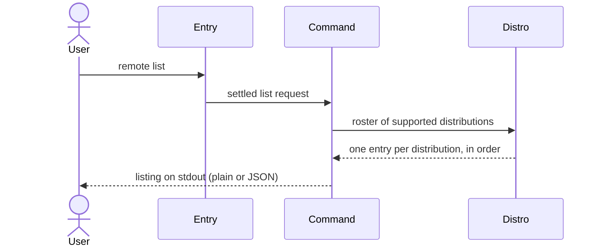

---
tags:
  - architecture
  - spec
  - remote
---

# Listing Distributions

| | |
|---|---|
| **Status** | As-built |
| **Trigger** | `flatroot remote list` |
| **Actor** | A CLI user orienting themselves before choosing what to build from |

## User Scenarios & Testing

### User Story 1 — Discover what can be built from

A user asks which distributions are even an option and exactly how to ask for one, and receives the complete roster — each entry with the selector syntax it documents — instantly and offline, drawn from the same single authority every other decision in the tool funnels through.

**Independent test**: Run the command with no network access and verify the full roster renders with one selector-syntax example per distribution.

**Acceptance scenarios**:

1. **Given** no source selector and no network, **When** the user lists remotes, **Then** stdout carries one entry per supported distribution in the roster's fixed order, each with its `--from` syntax and status.
2. **Given** `--format json`, **When** the listing runs, **Then** the same roster renders as a JSON array carrying identical facts.
3. **Given** a `--from` value present in the environment, **When** the listing runs, **Then** the selector is simply not consulted — the question is about the tool, not any one source.

## Requirements

### Functional requirements

**Answer source**

**FR-ANSWER-001**: The system MUST answer entirely from built-in knowledge: no source selector required, no network request made.

```console
$ flatroot remote list        # works offline, with no --from
```

**FR-ANSWER-002**: The system MUST draw the roster from the single authoritative registry, so the listing can never disagree with what an install would accept.

```console
$ flatroot remote list | grep name=     # every prefix here is exactly what --from accepts
remote.list.0.name=debian
remote.list.3.name=alpine
```

**Rendering**

**FR-RENDER-001**: The system MUST render each distribution with its user-typed prefix, its documented selector syntax, and its support status, in the roster's fixed presentation order.

```console
$ flatroot remote list
remote.list.0.format=debian:<release>[@<date>]
remote.list.0.name=debian
remote.list.0.status=supported
```

**FR-RENDER-002**: The system MUST offer the listing in the two bijective encodings selected by `--format`.

```console
$ flatroot remote list --format json    # the same roster as a JSON array, identical facts
```

### Key entities

- **Remote entry** — one buildable distribution: prefix, selector syntax, support status.

## Success Criteria

### Measurable outcomes

- **SC-001**: The command performs zero network requests.
- **SC-002**: For a given binary, repeated runs produce byte-identical output.
- **SC-003**: Every prefix the listing names is accepted by an install's source resolution, and vice versa.

## Assumptions

- None — the answer is a fact about the tool itself.

## Edge Cases

- This use case has no refusal paths of its own; it reports built-in knowledge.

## Execution flow *(as-built)*

| # | Operation | Performed by | Source |
|---|---|---|---|
| 1 | Settle the invocation — only the output format is chosen | [Command-Line Entry and Dispatch](../packages.md#command-line-entry-and-dispatch) | `src/parser.rs`, `src/executor.rs` |
| 2 | Read the authoritative roster of supported distributions, in presentation order, with each one's selector syntax | [Distribution Catalog](../packages.md#distribution-catalog) | `src/distro/registry.rs` |
| 3 | Render one entry per distribution in the requested encoding | [Subcommand Orchestration](../packages.md#subcommand-orchestration) | `src/commands/remote.rs`, `src/commands/report.rs` |



--8<-- "_glossary.md"
