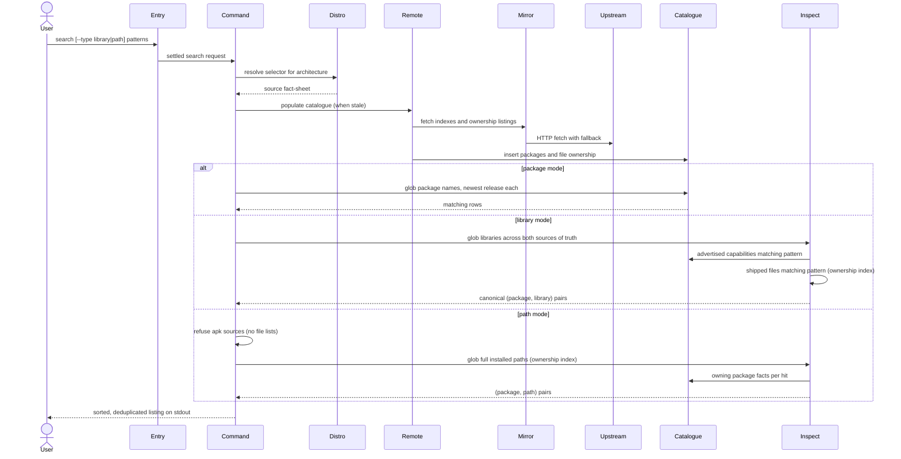

---
tags:
  - architecture
  - spec
  - search
---

# Searching Packages

| | |
|---|---|
| **Status** | As-built |
| **Trigger** | `flatroot --from debian:bookworm search 'firefox*'` |
| **Actor** | A CLI user deciding what to install, or working backwards from a library a program failed to load or a file they need on disk |

## User Scenarios & Testing

### User Story 1 — Find a package by name

A user matches one or more shell-style patterns against a distribution's package names and receives a deduplicated, ordered listing — each hit carrying the name to install, its pinned version, and a description to tell similar entries apart.

**Independent test**: Search a known prefix pattern against a live release and verify each match carries name, version, and description, sorted by name with no duplicates.

**Acceptance scenarios**:

1. **Given** a reachable catalogue, **When** the user searches `firefox*`, **Then** stdout carries one entry per matching package, sorted, each at its newest release under the family's version ordering.
2. **Given** several overlapping patterns, **When** the search runs, **Then** the hits are unioned and a package appears at most once.
3. **Given** a pattern that matches nothing, **When** the search runs, **Then** stdout carries zero bytes (plain) or an explicit empty array (JSON) and the exit code is `0`.

### User Story 2 — Find which package supplies a library

A user holds a library name — typically one a program failed to load — and asks which packages would supply it, with the answer drawn from both sources of truth: what packages advertise and what they actually ship on disk.

**Independent test**: Search `--type library 'libssl*'` against a live release and verify each hit pairs a canonical library spelling with its owning package.

**Acceptance scenarios**:

1. **Given** a library shipped on disk but never advertised, **When** the user searches for it by name, **Then** the file-ownership leg still finds it and ties it to its owning package.
2. **Given** a library both advertised and shipped, **When** the search runs, **Then** the same `(package, library)` pair appears exactly once.
3. **Given** a distribution that decorates library names (namespace prefixes, width suffixes, version tails), **When** matches are rendered, **Then** every library is spelled in one canonical form.
4. **Given** a pattern matching non-library capabilities, **When** the search runs in library mode, **Then** anything not shaped like a shared object or static archive is excluded.

### User Story 3 — Find which package ships a file

A user holds a concrete installed path — a command, a configuration file, a font — and asks which package would put it there, matching against the full path so the same filename in two locations resolves to its two distinct owners.

**Independent test**: Search `--type path 'bin/bash'` against a live Debian release and verify the single hit pairs the full path with the `bash` package.

**Acceptance scenarios**:

1. **Given** the same filename shipped in two directories by two packages, **When** the user searches the full path of one, **Then** only that location's owner is reported.
2. **Given** a file that is not a library — a config, a data file — **When** the user searches its path, **Then** it is found; the path match space applies no library-shape filter.
3. **Given** an apk source, **When** a path search is requested, **Then** it is refused with the reason — Alpine publishes no file lists — never answered with misleading emptiness.
4. **Given** `--type path --match all` with one or more paths, **When** the search runs, **Then** only packages owning a match for every listed path have their pairs rendered; the default `--match any` renders every owner's pairs, and an empty intersection emits zero bytes.

## Requirements

### Functional requirements

**Request**

**FR-SOURCE-001**: The system MUST require a source selector and refuse its absence with example selectors.

```console
$ flatroot search bash       # ✗ --from is required. Example: --from debian:bookworm, …
```

**Pattern semantics**

**FR-MATCH-001**: The system MUST match patterns case-insensitively with shell-style semantics (`*`, `?`, `[abc]`), each pattern matching exactly when it carries no wildcard.

```console
$ flatroot --from debian:bookworm search 'python3.??'   # python3.11, python3.12, …
$ flatroot --from debian:bookworm search firefox-esr    # exact name only
```

**Package match space**

**FR-PKG-001**: The system MUST collapse every package-name match to its newest release under the distribution family's version ordering.

```console
$ flatroot --from debian:bookworm search bash
search.0.description=GNU Bourne Again SHell
search.0.name=bash
search.0.version=5.2.15-2+b10    # the newest under dpkg ordering, never one row per old revision
```

**Library match space**

**FR-LIB-001**: In library mode, the system MUST consult both sources of truth — the advertised capabilities (including the dedicated `so:` namespace) and the shipped-file index — so a library known to only one source is still found.

```console
$ flatroot --from debian:bookworm search --type library 'libssl.so.3'   # found via shipped files (deb advertises no sonames)
$ flatroot --from alpine:edge search --type library 'libssl.so.3'       # found via so: provides (apk ships no file lists)
```

**FR-LIB-002**: In library mode, the system MUST filter out anything not shaped like a shared object or static archive, so a broad pattern never drags in unrelated capabilities.

```console
$ flatroot --from debian:bookworm search --type library 'awk'   # the virtual capability `awk` is not a library — excluded
```

**FR-LIB-003**: The system MUST canonicalise each distribution's library decorations — `so:` prefixes, `()(64bit)`/`()(32bit)` suffixes, `=version` tails — so one library reads identically everywhere.

```text
so:libssl.so.3=3 (apk) · libssl.so.3()(64bit) (rpm) · libssl.so.3 (deb Contents)  →  library=libssl.so.3
```

**FR-LIB-004**: The system MUST emit one entry per `(package, library)` pair — the same pair reported by both sources, or by several patterns, appears exactly once.

```console
$ flatroot --from fedora:42 search --type library 'libssl.so.3*'
# filelists and provides both know the pair — one entry, not two
```

**Path match space**

**FR-PATH-001**: In path mode, the system MUST match each pattern against the full installed path drawn from the distribution's file lists, spelled without the leading slash, with no shape filter and no renaming — the answer reads back exactly as the file lists record it. Wildcards are not path-segment-bounded: `*` and `?` cross `/`, so `etc/ssl/*` matches the entire `etc/ssl` subtree, not just its direct children.

```console
$ flatroot --from debian:bookworm search --type path 'bin/bash'
search.0.description=GNU Bourne Again SHell
search.0.name=bash
search.0.path=bin/bash
search.0.version=5.2.15-2+b10
$ flatroot --from fedora:42 search --type path 'etc/ssl/*'      # * crosses /, so the whole etc/ssl subtree matches — configs and data files included
```

**FR-PATH-002**: The system MUST emit one entry per `(package, path)` pair, so the same filename in two locations resolves to its two distinct owners.

```console
$ flatroot --from debian:bookworm search --type path 'usr/*/foo'
# usr/bin/foo → foo-cli and usr/lib/foo → foo-lib are two entries, disambiguated by path
```

**FR-PATH-003**: The system MUST refuse a path search against an apk source with the reason — Alpine publishes no file lists — never answering with misleading emptiness.

```console
$ flatroot --from alpine:v3.21 search --type path 'usr/bin/bash'
# ✗ --type path is unsupported for apk sources: Alpine publishes no file lists
```

**Pattern combination**

**FR-COMBINE-001**: In library and path mode, the system MUST accept `--match <any|all>` (default `any`): `any` renders every matched pair; `all` keeps only pairs whose package owns a match for *every* pattern — the no-install preview of an `install --match all` intersection. `--match all` is refused with `--type package`.

```console
$ flatroot --from debian:bookworm search --type path --match all usr/sbin/sendmail usr/sbin/postfix
search.0.name=postfix          # the one package owning both paths
```

**Rendering**

**FR-RENDER-001**: The system MUST union multi-pattern hits, sort the listing, and deduplicate before rendering.

```console
$ flatroot --from debian:bookworm search 'libssl*' 'libcrypto*'   # one sorted listing, no repeats
```

**FR-RENDER-002**: The system MUST offer the same facts in two bijective encodings — flat dotted lines and structured JSON — selected by `--format`.

```console
$ flatroot --from debian:bookworm search --format json 'firefox*'   # same facts as plain, different syntax
```

**FR-RENDER-003**: The system MUST treat an empty result as a legitimate answer: zero stdout bytes in plain mode, an explicit empty array in JSON mode, exit code `0`.

```console
$ flatroot --from debian:bookworm search 'zzz-nonexistent-*'; echo $?
0
```

**Side effects**

**FR-SIDE-001**: The system MUST leave the host unchanged apart from the warmed catalogue cache.

```console
$ flatroot --from debian:bookworm search bash   # writes nothing but ~/.cache/flatroot/…
```

### Key entities

- **Search entry** — a matched package: name, pinned version, description.
- **Library entry** — a matched `(package, library)` pair with the library spelled canonically, plus the owning package's version and description.
- **Path entry** — a matched `(package, path)` pair with the full installed path as the file lists record it, plus the owning package's version and description.

## Success Criteria

### Measurable outcomes

- **SC-001**: A zero-match search exits `0` with zero bytes on stdout in plain mode.
- **SC-002**: The plain and JSON renderings of the same search carry identical facts.
- **SC-003**: No `(package, library)` or `(package, path)` pair appears twice, regardless of how many sources or patterns reported it.
- **SC-004**: A path search against an apk source exits non-zero with the reason on stderr — never exit `0` with empty stdout.

## Assumptions

- A source selector is given and names a supported distribution and release.
- The network is reachable, or a fresh cached catalogue exists for this source and architecture.
- On Alpine, library matching leans entirely on advertised `so:` capabilities, since no file-ownership listing is published — which is also why the path match space is unsupported there.

## Edge Cases

- What happens with an unknown distribution, release, or unsupported architecture? An unknown distribution, and an architecture a distribution does not build for, are refused at source resolution with the supported set spelled out. An out-of-vocabulary architecture token (e.g. `sparc`) fails earlier at architecture parsing, naming the token but listing no set. An unknown release is pre-validated only by the static-table distributions (CentOS, AlmaLinux, Rocky, CachyOS); for the mirror-walking distributions the release rides into the mirror URLs and surfaces later as an index-fetch error.
- What happens when every mirror fails and no fresh cache exists? Hard error after the retry budget, naming the listing that failed.
- What happens with a malformed glob in library or path mode? Hard error naming the pattern.
- What happens with a path search on Alpine? Refused with the reason (FR-PATH-003).
- What happens when the path index names a package absent from the catalogue? Hard error naming the package — an index inconsistency, never a silently dropped hit.

## Execution flow *(as-built)*

| # | Operation | Performed by | Source |
|---|---|---|---|
| 1 | Settle the invocation — source required, architecture parsed, match space and output format chosen | [Command-Line Entry and Dispatch](../packages.md#command-line-entry-and-dispatch) | `src/parser.rs`, `src/executor.rs` |
| 2 | Resolve the selector to a source fact-sheet and populate or reuse the local catalogue and file-ownership index, drawing on the run's settled fetch session | [Subcommand Orchestration](../packages.md#subcommand-orchestration), [Distribution Catalog](../packages.md#distribution-catalog), [Format-Neutral Repository Access](../packages.md#format-neutral-repository-access), [Persistent Package Catalogue](../packages.md#persistent-package-catalogue) | `src/commands/session.rs`, `src/commands/arch_context.rs`, `src/distro/`, `src/remote/`, `src/db.rs` |
| 3 | Package mode: match each pattern against package names, collapsing every match to its newest release under the family's version ordering | [Persistent Package Catalogue](../packages.md#persistent-package-catalogue) | `src/db.rs` |
| 4 | Library mode: match each pattern against both sources of truth — the capabilities packages advertise (including the `so:` namespace) and the files they actually ship — filter out non-library shapes, canonicalise decorations, and tie each hit to its owning package | [Binary and System Inspection](../packages.md#binary-and-system-inspection) | `src/library.rs`, `src/path_index.rs` |
| 5 | Path mode: refuse an apk source up front, then match each pattern against the full installed paths the file-ownership index records and tie each hit to its owning package | [Subcommand Orchestration](../packages.md#subcommand-orchestration), [Binary and System Inspection](../packages.md#binary-and-system-inspection) | `src/commands/search.rs`, `src/path.rs`, `src/path_index.rs` |
| 6 | Union the per-pattern hits, sort, and deduplicate into one stable listing | [Subcommand Orchestration](../packages.md#subcommand-orchestration) | `src/commands/search.rs` |
| 7 | Render the listing in the requested encoding — flat dotted lines or structured JSON, carrying the same facts | [Subcommand Orchestration](../packages.md#subcommand-orchestration) | `src/commands/report.rs`, `src/internal/printer_plain.rs` |



--8<-- "_glossary.md"
