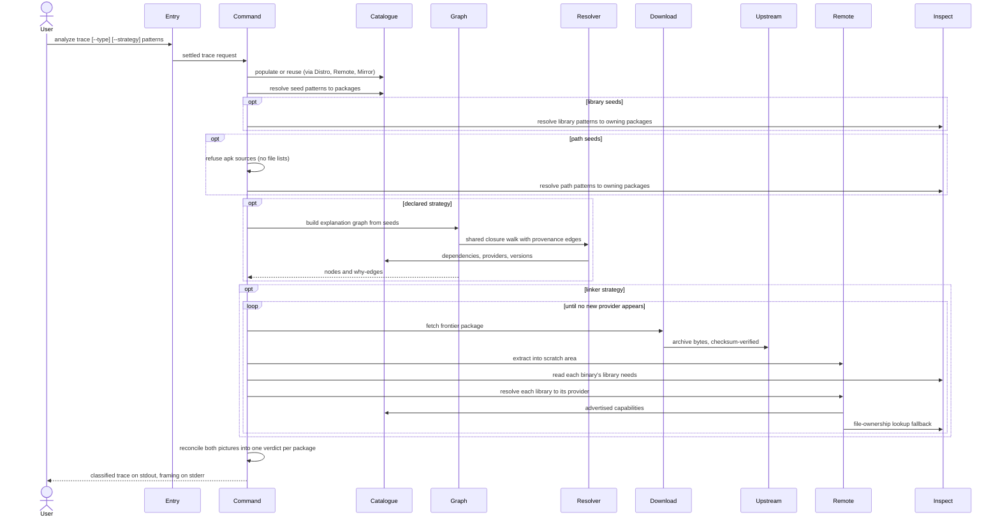

---
tags:
  - architecture
  - spec
  - analyze
---

# Tracing Dependencies

| | |
|---|---|
| **Status** | As-built |
| **Trigger** | `flatroot --from debian:bookworm analyze trace bash` |
| **Actor** | A CLI user judging what a set of packages would really drag into a rootfs before committing to an install |

## User Scenarios & Testing

### User Story 1 — See what a package really drags in

A user names starting packages and receives one classified entry per package reached — through declared metadata, through real runtime linkage, or both — so under-declared dependencies and unsatisfiable libraries are visible before anything is committed to disk.

**Independent test**: Trace one package with both strategies against a live release and verify every entry carries a `reason` of `target`, `declared`, `linker`, or `declared_linker`, sorted by name.

**Acceptance scenarios**:

1. **Given** both strategies enabled (the default), **When** the trace runs, **Then** packages reached only by linkage are classified `linker` — the under-declarations the metadata missed — and packages reached both ways are `declared_linker`.
2. **Given** a binary needing a library nothing in the analysed set can supply, **When** the trace completes, **Then** the unsatisfied need is recorded against the demanding binary in its entry and tallied in a closing stderr warning, while stdout stays pure data.
3. **Given** seed patterns that match nothing, **When** the trace runs, **Then** stdout carries zero bytes in the default plain form (`--format json` emits `[]`), stderr frames the empty case, and the exit code is `0`.
4. **Given** the trace completes, **When** the filesystem is inspected, **Then** nothing was installed — the linkage pass worked in a throwaway scratch area, leaving only warmed caches.

### User Story 2 — Trace starting from a library or a file

A user holds a library name (`--type library`) or a concrete installed path (`--type path`) rather than a package name, and seeds the trace with whatever packages own the matches.

**Independent test**: Trace `--type library 'libssl*'` and verify the seed set is the owning packages, deduplicated, each marked `target`; trace `--type path 'bin/bash'` and verify `bash` seeds the trace.

**Acceptance scenarios**:

1. **Given** a library pattern owned by one package, **When** the trace runs, **Then** that package is the seed and is classified `target` regardless of how else it was reached.
2. **Given** a path pattern matching an installed path, **When** the trace runs, **Then** the package shipping that path is the seed, classified `target`.
3. **Given** `--type path` against an apk source, **When** the trace is requested, **Then** it is refused with the reason — Alpine publishes no file lists.
4. **Given** `--type path --match all` with one or more paths, **When** the trace runs, **Then** only a package owning a match for every listed path seeds the trace; an empty intersection seeds nothing, exits `0`, and renders the empty outcome.

### User Story 3 — Run a single strategy

A user runs only the declared pass (cheap, metadata-only) or only the linkage pass (downloads and reads binaries), accepting the correspondingly narrower classification vocabulary.

**Independent test**: Run `--strategy declared` and verify no archive is downloaded; run `--strategy linker` and verify entries classify as `target`/`linker` only.

**Acceptance scenarios**:

1. **Given** `--strategy=` resolving to neither pass, **When** the trace is requested, **Then** it is refused up front as an account of nothing.
2. **Given** a single-strategy run, **When** entries are classified, **Then** only `target` plus that strategy's reason can appear.

## Requirements

### Functional requirements

**Request**

**FR-REQUEST-001**: The system MUST require a source selector and at least one enabled strategy, refusing the empty strategy set up front.

```console
$ flatroot --from debian:bookworm analyze trace --strategy= bash   # ✗ refused: an account of nothing
```

**FR-REQUEST-002**: The system MUST run the trace against a single architecture — the first when several are named.

```console
$ flatroot --from debian:bookworm --arch x86_64,i686 analyze trace bash   # traces x86_64 only
```

**Seed resolution**

**FR-SEED-001**: The system MUST resolve seed patterns against package names by default.

```console
$ flatroot --from debian:bookworm analyze trace 'bash*'   # bash, bash-builtins, … seed the trace
```

**FR-SEED-002**: Under `--type library`, the system MUST resolve seed patterns against libraries — both advertised capabilities and shipped files — and seed with the owning packages.

```console
$ flatroot --from debian:bookworm analyze trace --type library 'libssl.so.3'   # seeds libssl3
```

**FR-SEED-003**: Under `--type path`, the system MUST resolve seed patterns against full installed paths from the file-ownership record and seed with the packages that ship the matches.

```console
$ flatroot --from debian:bookworm analyze trace --type path 'bin/bash'   # seeds bash via path ownership
```

**FR-SEED-004**: The system MUST refuse `--type path` against an apk source with the reason — Alpine publishes no file lists.

```console
$ flatroot --from alpine:v3.21 analyze trace --type path 'usr/bin/bash'
# ✗ --type path is unsupported for apk sources: Alpine publishes no file lists
```

**FR-SEED-005**: The system MUST combine the per-pattern matches as `--match` selects — unioned under the default `any`, intersected under `all` — deduplicate them preserving first-seen order, and pin every surviving seed to its concrete catalogue version.

```console
$ flatroot --from debian:bookworm analyze trace 'libssl*' 'libcrypto*'   # one seed set, no repeats, versions pinned
```

**FR-COMBINE-001**: The system MUST accept `--match <any|all>` (default `any`) in library and path seed modes: `any` unions the owning packages into the seed set; `all` intersects them, seeding the trace only from a package owning a match for *every* pattern. Refused with `--type package`; an empty intersection seeds nothing and renders the empty outcome of FR-OUTPUT-002.

```console
$ flatroot --from debian:bookworm analyze trace --type path --match all usr/sbin/sendmail usr/sbin/postfix
# traces only from postfix — the package owning both paths
```

**Declared pass**

**FR-DECLARED-001**: The declared pass MUST expand the seeds through the metadata's stated relationships using the same closure engine an install uses, keeping every edge's provenance — kind, chosen alternative, original constraint — in the explanation graph. The rendered output lists only the bare dependency names; the provenance stays internal.

```text
analyze.trace.1.depends_on.2=libc6        # rendered as a bare child name — the edge's kind, picked alternative, and constraint are kept in the graph but never emitted
```

**FR-DECLARED-002**: The system MUST honour `--with recommends,suggests` in the declared picture only; the linkage picture is always what the binaries say.

```console
$ flatroot --from debian:bookworm analyze trace --with recommends vlc   # widens declared edges; DT_NEEDED unchanged
```

**Linkage pass**

**FR-LINKER-001**: The linkage pass MUST download and extract each frontier package into a scratch area, read every binary's declared library needs, resolve each library to its providing package under the family's naming rules, and widen until no newly reached package adds anything unseen.

```text
bash → bin/bash needs libtinfo.so.6 → provider libtinfo6 → its binaries' needs → … until fixpoint
```

**FR-LINKER-002**: The system MUST verify every archive the linkage pass downloads against its checksum, with the same re-fetch-once-then-fail rule as an install.

```text
checksum mismatch → one re-fetch → still wrong → ✗ the trace never reasons over corrupt bytes
```

**Verdict**

**FR-VERDICT-001**: The system MUST reconcile the two pictures into one verdict per package from the closed set `target`, `declared`, `linker`, `declared_linker`, stamping seeds `target` last so the user's own request always reads as such.

```text
# entries render in strict alphabetical name order; reason is its own analyze.trace.N.reason= line
analyze.trace.0.name=bash       analyze.trace.0.reason=target           # the request itself
analyze.trace.1.name=libc6      analyze.trace.1.reason=declared_linker  # both pictures agree
analyze.trace.2.name=libfoo1    analyze.trace.2.reason=linker           # the metadata never declared it
```

**FR-VERDICT-002**: The system MUST attribute every satisfied runtime link end to end (binary, library, provider) and record every unsatisfiable one against the binary that demanded it.

```text
analyze.trace.1.sonames_consumed.0   = { binary: bin/bash, soname: libtinfo.so.6, provider: libtinfo6 }
analyze.trace.3.unresolved_sonames.0 = { binary: usr/bin/tool, soname: libmystery.so.1 }   # tallied on stderr
```

**Output**

**FR-OUTPUT-001**: The system MUST keep stdout pure data — entries sorted alphabetically, in the two bijective encodings — with the run's framing and the unresolved tally on stderr.

```console
$ flatroot --from debian:bookworm analyze trace bash 2>/dev/null   # stdout: only trace.N.* lines
```

**FR-OUTPUT-002**: The system MUST treat an aggregate-empty seed match as a legitimate empty answer with exit code `0`.

```console
$ flatroot --from debian:bookworm analyze trace 'zzz-*'; echo $?
0
```

### Key entities

- **Trace entry** — one reached package: name, version, reason, declared dependencies, libraries provided to others, per-binary consumed links with their providers, and per-binary unsatisfied needs.
- **Classification** — the closed reason vocabulary distinguishing requested, declared-only, linkage-only, and both.
- **Provenance edge** — the record of why one package pulled in another: kind, chosen alternative, original constraint.

## Success Criteria

### Measurable outcomes

- **SC-001**: A trace installs nothing: outside the cache directories, the filesystem is unchanged after the run.
- **SC-002**: Entries are sorted and stable: two runs against the same catalogue produce identical stdout.
- **SC-003**: Every library a binary consumes is either attributed to a providing package or recorded as unresolved — none silently dropped.
- **SC-004**: An empty seed match exits `0`; the default plain form emits zero stdout bytes (`--format json` emits `[]`).

## Assumptions

- A source selector is given; the catalogue and archive caches are reachable or warm — the linkage pass downloads every package it visits.
- The seeds exist in the chosen release once patterns are resolved.

## Edge Cases

- What happens when a declared dependency names a package absent from the catalogue? Hard error from the closure walk naming the package.
- What happens when an archive's checksum still disagrees after one re-fetch? Hard failure — the trace never reasons over corrupt bytes (FR-LINKER-002).
- What happens when a library resolves to no provider? Not a failure: recorded per binary, tallied on stderr (FR-VERDICT-002).
- What happens when `--arch` names several architectures? Only the first is traced (FR-REQUEST-002).
- What happens with `--type path` on an apk source? Refused with the reason (FR-SEED-004).

## Execution flow *(as-built)*

| # | Operation | Performed by | Source |
|---|---|---|---|
| 1 | Settle the invocation — refuse an empty strategy set, take the first architecture, translate the chosen strategies into the passes to run | [Command-Line Entry and Dispatch](../packages.md#command-line-entry-and-dispatch) | `src/executor.rs` |
| 2 | Resolve the selector to a source fact-sheet and populate or reuse the local catalogue and file-ownership index, drawing on the run's settled fetch session | [Subcommand Orchestration](../packages.md#subcommand-orchestration), [Distribution Catalog](../packages.md#distribution-catalog), [Format-Neutral Repository Access](../packages.md#format-neutral-repository-access), [Persistent Package Catalogue](../packages.md#persistent-package-catalogue) | `src/commands/session.rs`, `src/commands/arch_context.rs`, `src/distro/`, `src/remote/`, `src/db.rs` |
| 3 | Resolve the seed patterns — package globs against the catalogue, library globs resolved to owning packages, or full-path globs resolved through the file-ownership record (apk refused with the reason) — unioned, deduplicated, and pinned to concrete versions; an aggregate-empty match ends the trace as a legitimate empty answer | [Subcommand Orchestration](../packages.md#subcommand-orchestration), [Persistent Package Catalogue](../packages.md#persistent-package-catalogue), [Binary and System Inspection](../packages.md#binary-and-system-inspection) | `src/commands/analyze/trace.rs`, `src/db.rs`, `src/library.rs`, `src/path.rs` |
| 4 | Declared pass: expand the seeds through the metadata's stated relationships into the explanation graph, keeping every edge's provenance — kind, chosen alternative, original constraint | [Dependency Graph Assembly](../packages.md#dependency-graph-assembly), [Dependency Closure Resolution](../packages.md#dependency-closure-resolution) | `src/commands/analyze/pass/declared.rs`, `src/dep_tree.rs`, `src/resolver/` |
| 5 | Linkage pass: starting from the seeds, download and extract each frontier package, read every binary's declared library needs, resolve each library to the package that supplies it under the family's naming rules, and widen until no newly reached package adds anything unseen | [Subcommand Orchestration](../packages.md#subcommand-orchestration), [Verified Parallel Download](../packages.md#verified-parallel-download), [Format-Neutral Repository Access](../packages.md#format-neutral-repository-access), [Binary and System Inspection](../packages.md#binary-and-system-inspection) | `src/commands/analyze/pass/linker.rs`, `src/downloader.rs`, `src/remote/soname.rs`, `src/elf.rs` |
| 6 | Reconcile the two pictures into one verdict per package — targets stamped last so the user's own request always reads as such — and tally the library needs nothing could satisfy | [Subcommand Orchestration](../packages.md#subcommand-orchestration) | `src/commands/analyze/outcome.rs` |
| 7 | Render the classified entries on stdout, with the human framing (what was analysed, from where) and the unresolved-soname warning kept on stderr | [Subcommand Orchestration](../packages.md#subcommand-orchestration), [Command-Line Entry and Dispatch](../packages.md#command-line-entry-and-dispatch) | `src/commands/analyze/render.rs`, `src/executor.rs` |



--8<-- "_glossary.md"
